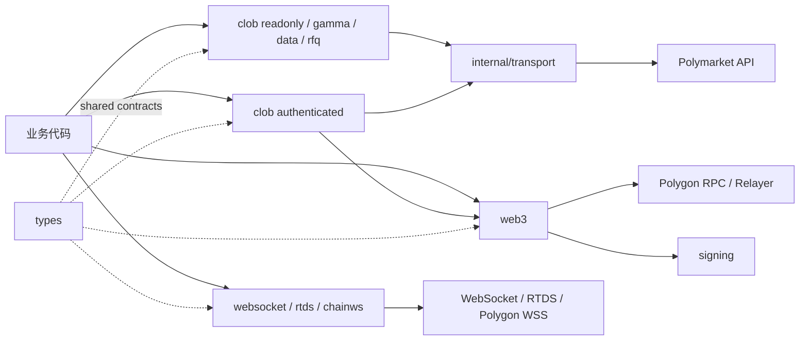

# 架构说明

SDK 的边界跟随外部服务，而不是把所有能力塞进单个全局 client。这样只读业务无需触碰私钥，实时订阅与 REST 也能独立演进。

## 分层

### 领域客户端

`clob`、`gamma`、`data`、`rfq` 对外暴露按领域组织的接口。构造函数返回接口或客户端，调用方不依赖具体实现。CLOB 又拆成只读市场数据和认证交易两条入口，减少无意加载敏感凭证的风险。

### 实时客户端

`websocket` 处理 Polymarket market/user/sports channel，`rtds` 处理 RTDS，`chainws` 处理 Polygon 日志。它们有独立生命周期，业务层负责启动、停止、重连后的状态处理和 context 取消。

### 链上与签名

`web3` 负责 RPC、钱包解析、余额、授权和交易编排；`signing` 负责本地密钥与协议签名。私钥不应进入 `types`、日志或业务缓存，持有 signer 的客户端结束使用后必须 `Close()`。

### 通用基础设施

`types` 是跨包数据契约；`internal/transport` 和 `errors` 提供传输与错误支撑；`internal/testutil` 只服务仓库测试。SDK 不再暴露全局 `config`、独立 `middleware` 或低层 `http` 包，避免形成两套实际行为不一致的配置与网络路径。

## 依赖规则

- 业务代码导入领域包和 `types`，不导入 `internal`。
- 领域包可以依赖 `internal/transport`、`errors`、`signing`、`web3` 和 `types`，反向依赖应避免。
- 公共 wire 类型放在 `types`；只属于单一协议实现的类型留在领域包。
- 新增网络方法时同时考虑 context、超时、错误分类和重试语义。
- 自动重试只适用于幂等请求；交易、撤单或链上写入出现模糊结果时先对账。

## 扩展入口

- 新 REST 端点：放入对应领域包，复用 `internal/transport`，导出 `Context` 版本。
- 新实时 feed：保持独立连接生命周期，不把连接状态藏进 REST client。
- 新钱包类型：先在 `types.SignatureType` 和 `signing` 建立明确语义，再接入 `web3`/`clob`。
- 新跨模块类型：确认确实被多个领域共享后再放进 `types`，避免形成杂物包。

架构变更完成后同步更新 [API 概览](api-overview.md)和可运行示例；历史设计方案放入 [`archive/`](archive/README.md)。
